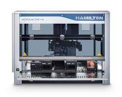
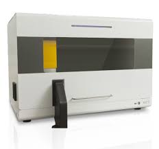
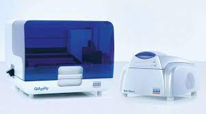

#  

## А вы владеете такими молекулярно-биологическими методами как:

1. ПЦР
2. ИФА
3. РГА
4. РА
3. Секвенирование нуклеиновых кислот

## А вам под силу запустить вот такие приборчики?

# 

# 

# 

## А теперь я изучаю программирование... Возможно, мне удастся внести свой вклад в создание искусственного интеллекта

# 

